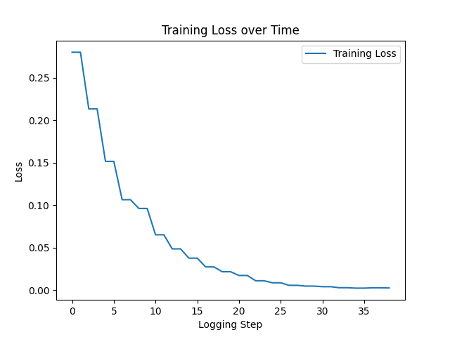

# Kotlin Code Generation and Fine-tuning

In this repository, I implemented the Kotlin code generation task based on the [Textbooks Are All You Need](https://arxiv.org/abs/2306.11644) paper. The objective was to evaluate a selected model on the [Kotlin Human Eval benchmark](https://huggingface.co/datasets/JetBrains/Kotlin_HumanEval), prepare a synthetic dataset for fine-tuning, and analyze the effects of fine-tuning on model performance.

## Project Overview

In this project, I:

1. **Selected a Model**: I chose to use the `granite-3b-code-base` model.
2. **Created a Synthetic Dataset**: I generated my dataset using ChatGPT, separating the examples into `data_train.json` and `data_eval.json` files, each containing prompts and their corresponding solutions.
3. **Evaluated the Model**: I ran the Kotlin Human Eval dataset on the model, which yielded the following results:
   - **Executable code**: 98
   - **Broken code** (code that can't be runned): 63
   - **Good results from executable**: 98.99%

4. **Fine-tuned the Model**: I attempted to fine-tune the selected model on the synthetic Kotlin dataset. Unfortunately, after fine-tuning, the model did not perform as expected. Instead of generating coherent outputs, it returned random tokens that did not make sense.

## How it works
### `evaluation.py`

This module is designed to **evaluate the performance** of the Kotlin code generation model. Key functionalities include:

- **Cleaning Prompts**: Prepares prompts for model input by removing unnecessary characters and formatting.
- **Extracting Kotlin Code**: Isolates the generated Kotlin code from the model's output.
- **Performance Metrics**: Calculates various performance statistics against the Kotlin Human Eval benchmark. The main function, `evaluate_model_on_kotlin_humaneval`, generates code for each prompt, executes it against test cases, and provides insights into the model's ability to produce executable and correct code snippets.

### `test.py`

The `test.py` module is responsible for **compiling and executing** the generated Kotlin code. It includes:

- **Running Tests**: The `run_tests` function writes the generated code and its associated test cases to a temporary file, compiles the code using the Kotlin compiler, and runs the resulting JAR file.
- **Output Capture**: Captures the execution output to assess the number of passing test cases while handling any compilation errors.

Here’s a more concise version of the training and fine-tuning section for your README:

## Training and Fine-Tuning

The training and fine-tuning of the `granite-3b-code-base` model are essential for enhancing its ability to generate Kotlin code. This process involves several key steps:

### 1. Data Preparation

The synthetic dataset, created from prompts and solutions, is loaded from `data_train.json` and `data_eval.json` and formatted for training.

### 2. Input preparation for model training

In training the `granite-3b-code-base` model, the input data is formatted to enhance Kotlin code generation. The `formatting_prompts_func` constructs each input as follows:

```python
def formatting_prompts_func(example):
    output_texts = []
    for i in range(len(example)):
        text = (f"<|system|>Write a function without explanation.\n"
                f"<|user|>You are an expert Kotlin programmer. Task: {example['prompt'][i]}\n"
                f"<|assistant|>\n{example['solution'][i]}<|endoftext|>")
        output_texts.append(text)
    return output_texts
```

Each input consists of a system prompt, a user task, and the corresponding solution. This structured approach helps the model learn to generate relevant Kotlin code effectively.

### 3. Loss Monitoring

A custom callback, `LossLoggingCallback`, tracks loss values throughout the training process, which are visualized using Matplotlib to assess model convergence.

<div align="center">
    
</div>

From this plot, we can observe that the loss is decreasing over time, indicating that the model is effectively learning from the training data. This reduction in loss suggests that the model is improving its performance on the task at hand.

## Results

Although the training process was structured, the fine-tuning did not yield the expected results. The model generated random tokens instead of coherent Kotlin code.

## Setup Instructions

### Prerequisites

Ensure you have Python 3.x and pip installed on your machine.

### Step 1: Clone the Repository

First, clone the repository to your local machine:

```bash
git clone https://github.com/Olivera2708/Codegen-evaluation
cd Codegen-evaluation
```

### Step 2: Install Requirements

Next, install the required dependencies using pip:

```bash
pip install -r requirements.txt
```

### Step 3: Run the Main Script

Finally, you can run the main script to execute the code:

```bash
python3 main.py
```